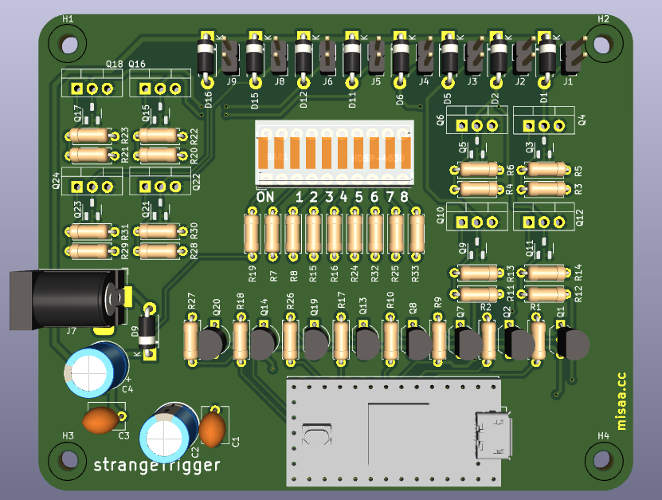
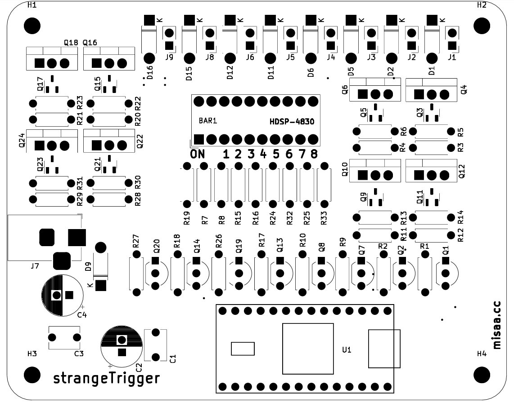

# strangeTrigger

Controlador de motores DC vía MIDI/USB

Mapea hasta 8 motores a las salidas de la Teensy. Diseñada para 3.2

## Administración

[Carpeta privada](https://drive.google.com/drive/u/0/folders/1ZfvROWbhmU7-pQveVyhd7USzzsyxc5iU)

La versión 2025 utiliza 8 salidas de Teensy. Por error, las últimas 2 salidas de la versión (pines D15 y D16) solo entregan valores digitales, ya que esas salidas no están diseñadas para utilizar PWM

La versión old utilizaba MAX/MPS como intermediario para convertir MIDI a PWM. Ahora aparece directamente como dispositivo MIDI bajo el nombre de "strangeMidi"

## PCB Front

[schematic](./strangeTrig_sch.pdf)

(soy Bernardita y este texto es de prueba. Por favor Aaron eliminar)

